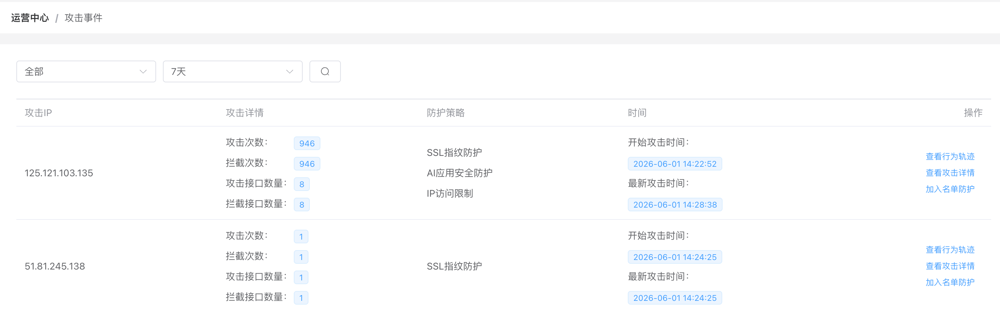
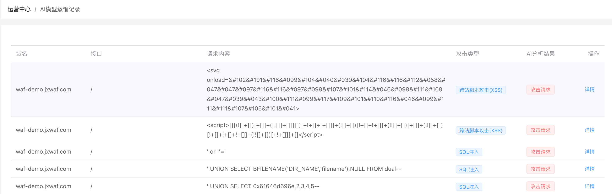

[中文](README.md) | English

# JXWAF Professional Edition

An AI‑powered Web Application Firewall. It analyses web traffic in real time, scrubs malicious requests, and forwards clean traffic to your backend servers — keeping your business secure and stable.

🌟 **AI Security Model** | **Semantic Analysis Engine** | **SSL Behaviour Analysis Engine** | **WebTDS Real‑time Analysis**

> 📖 Full documentation: [https://docs.jxwaf.com](https://docs.jxwaf.com)

> 🔗 **Live Demo**: [https://waf-demo.jxwaf.com](https://waf-demo.jxwaf.com)  
> Account: `demo`　Password: `123456`
<table align="center">
  <tr>
    <td align="center"><b>Site Protection</b></td>
    <td align="center"><b>Web Security Report</b></td>
  </tr>
  <tr>
    <td></td>
    <td></td>
  </tr>
  <tr>
    <td align="center"><b>Web Engine Config</b></td>
    <td align="center"><b>Traffic Engine Config</b></td>
  </tr>
  <tr>
    <td></td>
    <td></td>
  </tr>
  <tr>
    <td align="center"><b>Attack Events</b></td>
    <td align="center"><b>AI Model Distillation</b></td>
  </tr>
  <tr>
    <td></td>
    <td></td>
  </tr>
</table>


## Product Highlights

### AI Security Model
Built on a proprietary multi‑dimensional sparse attention mechanism and online distillation technology, the large‑model detection capability is efficiently transferred to a local inference engine, achieving **high concurrency, low cost, and low hallucination** web security detection. Supports **0‑day automatic detection** and **automatic false‑positive handling**, significantly reducing operational costs.

### Semantic Analysis Engine
Uses contextual, dynamic semantic analysis to move beyond traditional regular expression limitations, **accurately identifying attacks while drastically reducing false positives**. Effectively defends against SQL injection, XSS, command execution, code execution, and high‑risk N‑Day exploits.

### SSL Behaviour Analysis Engine
Based on a new SSL fingerprinting algorithm and protocol anomaly behaviour analysis, it quickly identifies non‑browser traffic and effectively detects **CC attacks**, **crawler traffic**, and other abnormal flows.

### WebTDS Real‑time Analysis
Integrated with a Web traffic threat perception system. A self‑developed real‑time big‑data analysis engine performs millisecond‑level threat analysis (far outperforming generic stream processing systems). No coding required — use policy configuration to enable **APT detection**, **advanced bot protection**, and **business risk analysis**.

## System Architecture

JXWAF consists of three independently deployed subsystems:

- **JXWAF Console (jxwaf_admin_server)** – Web UI for operations: site onboarding management, policy configuration, and report display.
- **JXWAF Node (jxwaf_node)** – High‑performance traffic proxy and real‑time attack detection engine built on OpenResty. Supports clustering and elastic scaling.
- **JXLOG Log System (jxlog)** – Lightweight Go‑based log collection, stored in ClickHouse. Supports event analysis and report statistics.

<p align="center"></p>

## Quick Deployment

### Requirements

| Item           | Requirement                  |
| -------------- | ---------------------------- |
| Operating system | Debian 12.x                |
| Minimum specs  | 4 vCPU, 8 GB RAM             |
| Dependencies   | Docker, Docker Compose       |

> All components are deployed via Docker Compose. Make sure Docker is properly installed.  
> Install command: `curl -fsSL https://get.docker.com | bash -s docker --mirror Aliyun`

### 1. JXWAF Console Deployment

```bash
git clone https://github.com/jx-sec/jxwaf.git
cd jxwaf/Professional/jxwaf_admin_server/

# Edit docker-compose.yml as needed (e.g., MySQL password, HTTPS toggle)
vim docker-compose.yml

docker compose up -d
```

After deployment, visit `http://<public-IP>`. You need to register an account on the first visit (strongly recommended to enable OTP two‑factor authentication).  
After logging in, go to **System Management → Basic Information** to obtain `waf_auth` for later node configuration.

#### Key Environment Variables

- `MYSQL_ROOT_PASSWORD` – MySQL root password (must be changed in production)
- `OPEN_REGIST` – Enable open registration (`false` disables new user registration)
- `JXWAF_MODEL_SERVER_HOST` / `JXWAF_MODEL_SERVER_PORT` / `JXWAF_MODEL_SERVER_SSL` – AI model service connection parameters

### 2. JXWAF Node Deployment

```bash
cd jxwaf/Professional/jxwaf_node

# Edit docker-compose.yml and set:
#   JXWAF_SERVER = console address (e.g. http://47.120.63.196)
#   WAF_AUTH      = waf_auth obtained from the console
#   HTTP_PORT / HTTPS_PORT = listening ports (comma‑separated for multiple)
vim docker-compose.yml

docker compose up -d
```

After starting, check **Operations Center → Node Status** in the console to confirm the node is online.

#### Key Environment Variables

**`jxwaf_base` container**:
- `HTTP_PORT` / `HTTPS_PORT` – listening ports, comma‑separated for multiple
- `JXWAF_SERVER` – console address (no trailing `/`)
- `WAF_AUTH` – console authentication key

**`jxwaf_nft_node` container**:
- `WAF_SERVER_URL` – console address
- `WAF_AUTH` – console authentication key
- `SYNC_INTERVAL` – configuration sync interval (seconds)

### 3. JXLOG Log System Deployment

```bash
cd jxwaf/Professional/jxlog
docker compose up -d
```

After deployment, complete the following configuration in the console:

**System Configuration → Log Forwarding Settings** (attack log upload to jxlog)

| Setting               | Value                         |
| --------------------- | ----------------------------- |
| Log server address    | `<jxlog internal IP>`         |
| Log server port       | `8877`                        |

**System Configuration → Log Query Settings** (query logs via ClickHouse)

| Setting               | Value                         |
| --------------------- | ----------------------------- |
| ClickHouse address    | `<jxlog internal IP>`         |
| Port                  | `9004`                        |
| Username / Password   | `jxlog` / `jxlog` (must be changed in production) |
| Database / Table      | `jxwaf` / `jxlog`             |

---

## Performance Test (Single Node, 4C8G)

Stress test of the AI security model service interface using `wrk`:

| Test Scenario                 | HTTP QPS | HTTPS QPS | HTTP Overhead | HTTPS Overhead |
| ----------------------------- | -------- | --------- | ------------- | -------------- |
| Pure forwarding (all off)     | 48,262   | 30,422    | —             | —              |
| AI protection + semantic engine | 31,159 | 21,343    | ↓ 35.5%       | ↓ 29.8%        |
| All protection engines on     | 18,462   | 13,253    | ↓ 61.7%       | ↓ 56.4%        |

**Conclusions**
- Pure forwarding exceeds **48K QPS (HTTP)** on a single node.
- Enabling AI + semantic engine reduces performance by only **≈30%** — minimal cost for deep defence.
- With all engines on, the node still handles **18K+ QPS**, average latency < 80ms, per‑core throughput > 4600 QPS, capable of processing over **300 million requests per day**.
- Horizontal scaling via clustering linearly increases throughput, suitable for high‑traffic enterprise scenarios.

Detailed raw data: [Performance Test Report](https://docs.jxwaf.com/jxwaf/Performance-Test.html).

---

## Protection Capability Test

Tests conducted using 477 attack PoCs generated from [PayloadsAllTheThings](https://github.com/swisskyrepo/PayloadsAllTheThings), covering 36 categories.

| Metric                | Value   |
| --------------------- | ------- |
| Total test cases      | 477     |
| Successfully blocked  | 461     |
| Not blocked (missed)  | 16      |
| Overall pass rate     | **96.6%** |

Category pass rates:
- SQL Injection (incl. MySQL/MSSQL/Oracle, etc.): **100%**
- XSS (incl. context‑aware bypasses): **100%**
- Command Injection (incl. WAF bypass): **95%+**
- File Inclusion / Directory Traversal: **100%**
- Deserialization (Java/PHP/Python, etc.): **100%**
- Server‑side Injection (SSTI/SSI/XSLT): **100%**
- File Upload (incl. bypasses): **100%**
- WAF Bypass Special (SQLi/XSS/Command/Path, etc.): **96%+**

Full details: [Protection Capability Test Report](https://docs.jxwaf.com/jxwaf/Protection-Capability-Test.html).

---

## Community Support

### Donations

If JXWAF helps you, feel free to scan the WeChat QR code to support us!

<p align="center"></p>

> Thank you to every supporter ❤️

### WeChat Official Account

Follow our official account for the latest updates and technical articles.

<p align="center"></p>

### User Group

Join our WeChat group to discuss and exchange ideas with other developers.

<p align="center"></p>

> If the group QR code expires or is full, contact admin via WeChat: `574604532` (add note: jxwaf)

## Contributors

- [chenjc](https://github.com/jx-sec)
- [jiongrizi](https://github.com/jiongrizi)

## Feedback

- WeChat: `574604532` (add note: jxwaf)