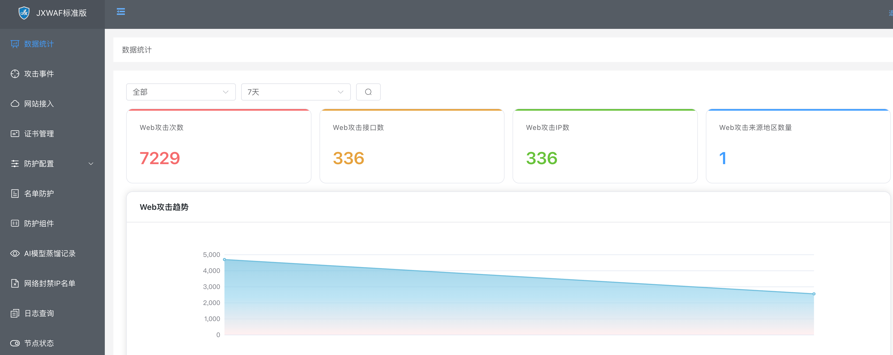
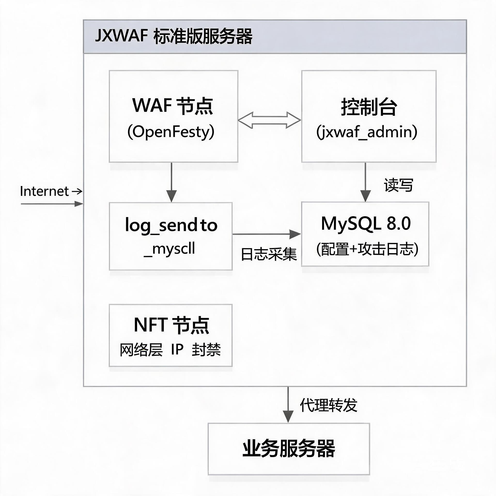
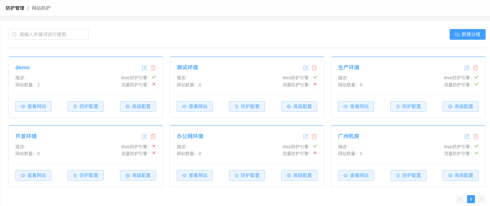
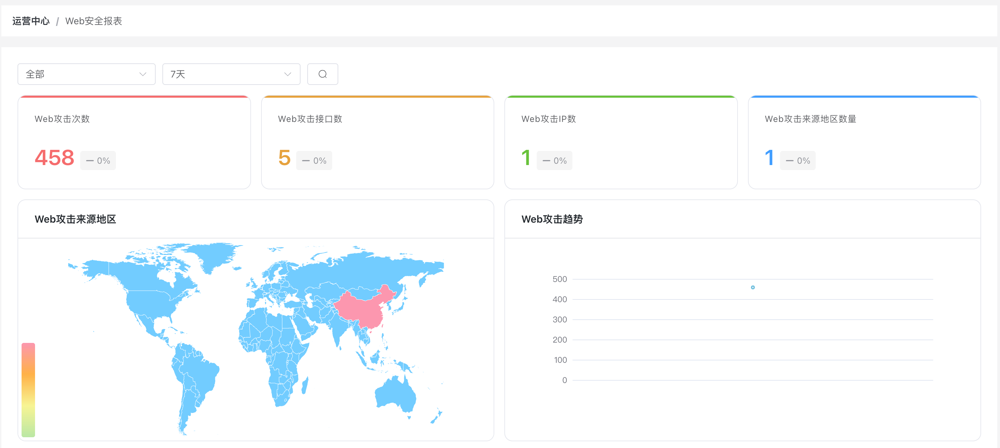
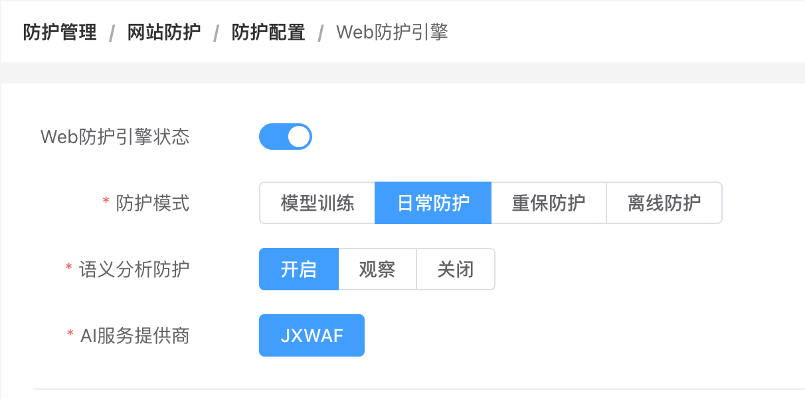
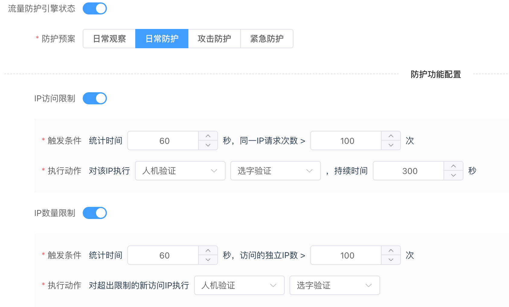
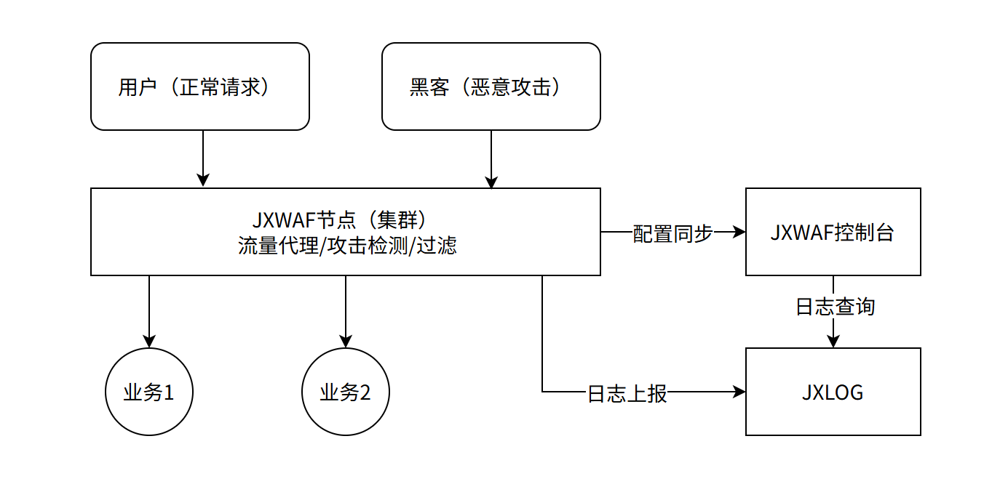

[中文](README.md) | English

# JXWAF

An AI‑powered Web Application Firewall. It analyses web traffic in real time, scrubs malicious requests, and forwards clean traffic to your backend servers — keeping your business secure and stable.

> 🌐 **Homepage**: **[https://www.jxwaf.com](https://www.jxwaf.com)**

> 📖 **Full documentation**: **[https://docs.jxwaf.com](https://docs.jxwaf.com)**

> 🔗 **Professional Edition Live Demo**: **[https://waf-demo.jxwaf.com](https://waf-demo.jxwaf.com)**  
> Account: `demo`　Password: `123456`

> JXWAF uses the officially provided security model service by default. AI model inference costs are covered by the platform — free for all users.

> All three editions are free with no performance limits. Simply choose the edition that fits your needs.

### Protection Test Comparison

The following results are from BlazeHTTP cross‑WAF benchmark tests. CloudFlare, ModSecurity, and SafeLine data were published by BlazeHTTP; JXWAF Daily Protection results were tested with the latest BlazeHTTP version:

| WAF | Detection Rate ↑ | False Positive Rate ↓ | Accuracy ↑ |
|-----|------------------|----------------------|-----------|
| CloudFlare Free | 10.70% | 0.07% | 98.40% |
| ModSecurity PARANOIA 1 | 69.74% | 17.58% | 82.20% |
| SafeLine Free · Balanced | 71.65% | 0.07% | 99.45% |
| **JXWAF Daily Protection (Official Free Model)** | **71.28%** | **0.64%** | **98.81%** |
| **JXWAF Daily Protection (Self‑Hosted Model)** | **69.91%** | **0.20%** | **99.22%** |

The test data shows:

- **Detection Rate**: JXWAF Daily Protection (71.28%) is on par with SafeLine (71.65%); ModSecurity is around 69.74%; CloudFlare Free is only 10.70%.
- **False Positive Rate**: JXWAF Daily Protection (0.64%) significantly outperforms ModSecurity (17.58%). With a self‑hosted model, the false positive rate drops further to 0.20%, with accuracy reaching 99.22%.

## Edition Selection

JXWAF offers **Standard**, **Professional**, and **Cloud WAF** editions to meet different business needs:

| Dimension | Standard | Professional | Cloud WAF |
|-----------|----------|-------------|-----------|
| Deployment Architecture | Single‑node deployment | Console, node, and log subsystems deployed separately | Management console + User console + Node |
| Scalability | Single node | Cluster deployment, horizontal scaling | Cluster deployment, horizontal scaling |
| Multi‑tenant Management | Not supported | Not supported | Supported |
| CNAME Auto‑Access | Not supported | Not supported | Supported |
| WebTDS | Not supported | Supported | Supported |
| Use Cases | Personal sites, small businesses | Medium to large enterprises | Enterprise multi‑department unified management |

## Standard Edition

Dual‑engine WAF powered by **AI Security Model** + **Semantic Analysis Engine**. Deploy with a single `docker compose up` command — free to use.

Unlike the Professional Edition's multi‑server architecture, the Standard Edition integrates the WAF node, console, database, log collector, and ban module on a single server. It analyses web traffic in real time, filters malicious requests, and forwards clean traffic to your backend servers.

<p align="center"></p>

### Three Core Technologies

#### 1. AI Security Model

Built on a proprietary multi‑dimensional sparse attention mechanism and online distillation technology, the large‑model detection capability is efficiently transferred to a local inference engine, achieving **high concurrency, low cost, and low hallucination** web security detection.

- **0‑day auto‑detection**: When a new attack emerges, the AI large model analyses it first and then transfers the detection capability to the local model via online distillation — no manual rule writing needed, 0‑day attacks are blocked automatically.
- **Auto false‑positive handling**: If false blocks occur during model updates, the security model automatically adds whitelists after online distillation completes — no security personnel intervention required.
- **High performance, low cost**: Runs on CPU only. A single 4C8G server with all protection modules enabled handles over **800 million requests per day**. The officially provided model service is used by default, with AI inference costs covered by the platform — free for all users.

#### 2. Semantic Analysis Engine

Uses contextual, dynamic semantic analysis to move beyond traditional regular expression limitations, **accurately identifying attacks while drastically reducing false positives**. Effectively defends against SQL injection, XSS, command execution, code execution, deserialization, high‑risk N‑Day exploits, and other mainstream web attacks.

#### 3. SSL Behaviour Analysis Engine

Based on a new SSL fingerprinting algorithm and protocol anomaly behaviour analysis, it quickly identifies non‑browser traffic and effectively detects **CC attacks**, **crawler traffic**, and other abnormal flows.

### Quick Deployment

The Standard Edition packages five subsystems — WAF node, console, MySQL, log collector, and network ban module — into a single `docker-compose.yml` file. One command to bring everything online.

**Requirements**: Debian 12.x / Ubuntu 20.04+, 4C8G minimum, Docker required.

```bash
# 1. Install Docker (skip if already installed)
curl -fsSL https://get.docker.com | bash -s docker --mirror Aliyun

# 2. Clone the repository (also available via wget: wget https://github.com/jx-sec/jxwaf/archive/refs/heads/master.zip)
git clone --depth=1 https://github.com/jx-sec/jxwaf.git
cd jxwaf/Standard/

# 3. One‑click start
docker compose up -d
```

After deployment, visit `http://<server-IP>:8000`. Register an account on your first visit.

Four protection modes: **Model Training** (learn, no blocking), **Daily Protection** (business‑first), **Heavy Protection** (security‑first), and **Offline Protection** (no internet required).

> Full deployment guide: [Standard Edition Deployment Tutorial](https://docs.jxwaf.com/jxwaf-standard/Deployment-Tutorial.html)

### System Architecture

All subsystems of the Standard Edition run on a single server:

<p align="center"></p>

| Subsystem | Description |
|-----------|-------------|
| `jxwaf_node_standard` | WAF node — traffic processing and real‑time attack detection |
| `jxwaf_admin_server` | WAF console — visual operations UI and API |
| `mysql_db` | MySQL 8.0 — stores site configurations and attack logs |
| `log_send_to_mysql` | Log collector — writes node attack logs to MySQL |
| `jxwaf_nft_node` | Network ban module — blocks attack IPs at the network layer |

### Performance Test (Single Node, 4C8G)

Real production interface testing with wrk (4 threads, 1000 concurrency, 60 seconds):

| Test Scenario | HTTP QPS | HTTPS QPS |
|---------------|----------|-----------|
| Pure forwarding | **67,849** | **55,227** |
| AI + Semantic Engine | **36,388** | **31,081** |
| All protection modules on | **10,574** | **7,739** |

With all modules enabled, a single node handles over **800 million requests per day**.

> JXWAF Standard Edition imposes no limits on processing threads, concurrent connections, protected sites, or request volume. Measured performance reflects what you actually get. You can upgrade server specs for even better results.

Full stress‑test details: [Performance Test Report](https://docs.jxwaf.com/jxwaf-standard/Performance-Test.html)

### Protection Capability Test

#### BlazeHTTP Cross‑WAF Comparison

The following results are from BlazeHTTP cross‑WAF benchmark tests. CloudFlare, ModSecurity, and SafeLine data were published by BlazeHTTP; JXWAF Daily Protection results were tested with the latest BlazeHTTP version:

| WAF | Detection Rate ↑ | False Positive Rate ↓ | Accuracy ↑ |
|-----|------------------|----------------------|-----------|
| CloudFlare Free | 10.70% | 0.07% | 98.40% |
| ModSecurity PARANOIA 1 | 69.74% | 17.58% | 82.20% |
| SafeLine Free · Balanced | 71.65% | 0.07% | 99.45% |
| **JXWAF Daily Protection (Official Free Model)** | **71.28%** | **0.64%** | **98.81%** |
| **JXWAF Daily Protection (Self‑Hosted Model)** | **69.91%** | **0.20%** | **99.22%** |

The test data shows:

- **Detection Rate**: JXWAF Daily Protection (71.28%) is on par with SafeLine (71.65%); ModSecurity is around 69.74%; CloudFlare Free is only 10.70%.
- **False Positive Rate**: JXWAF Daily Protection (0.64%) significantly outperforms ModSecurity (17.58%). With a self‑hosted model, the false positive rate drops further to 0.20%, with accuracy reaching 99.22%.

#### PayloadsAllTheThings Specialised Test

Based on [PayloadsAllTheThings](https://github.com/swisskyrepo/PayloadsAllTheThings) (GitHub 78.1k stars), 477 test cases across 36 attack categories — **overall pass rate 96.6%**. SQL injection, XSS, file inclusion, deserialization, server‑side injection and other core categories all achieved **100% pass rate**.

Detailed category pass rates: [Protection Capability Test Report](https://docs.jxwaf.com/jxwaf-standard/Protection-Capability-Test.html)

## Professional Edition

**AI Security Model** | **Semantic Analysis Engine** | **SSL Behaviour Analysis Engine** | **WebTDS Real‑time Analysis**

The Professional Edition consists of three independently deployed subsystems:

- **JXWAF Console (jxwaf_admin_server)** – Web UI for operations: site onboarding management, policy configuration, and report display.
- **JXWAF Node (jxwaf_node)** – High‑performance traffic processing and real‑time attack detection engine. Supports clustering and elastic scaling.
- **JXLOG Log System (jxlog)** – Log collection and analysis. Supports event analysis and report statistics.

<table align="center">
  <tr>
    <td align="center"><b>Site Protection</b></td>
    <td align="center"><b>Web Security Report</b></td>
  </tr>
  <tr>
    <td></td>
    <td></td>
  </tr>
  <tr>
    <td align="center"><b>Web Engine Config</b></td>
    <td align="center"><b>Traffic Engine Config</b></td>
  </tr>
  <tr>
    <td></td>
    <td></td>
  </tr>
</table>

### Product Highlights

#### AI Security Model
Built on a proprietary multi‑dimensional sparse attention mechanism and online distillation technology, the large‑model detection capability is efficiently transferred to a local inference engine, achieving **high concurrency, low cost, and low hallucination** web security detection. Supports **0‑day automatic detection** and **automatic false‑positive handling**, significantly reducing operational costs.

#### Semantic Analysis Engine
Uses contextual, dynamic semantic analysis to move beyond traditional regular expression limitations, **accurately identifying attacks while drastically reducing false positives**. Effectively defends against SQL injection, XSS, command execution, code execution, and high‑risk N‑Day exploits.

#### SSL Behaviour Analysis Engine
Based on a new SSL fingerprinting algorithm and protocol anomaly behaviour analysis, it quickly identifies non‑browser traffic and effectively detects **CC attacks**, **crawler traffic**, and other abnormal flows.

#### WebTDS Real‑time Analysis
Integrated with a Web traffic threat perception system. A self‑developed real‑time big‑data analysis engine performs millisecond‑level threat analysis (far outperforming generic stream processing systems). No coding required — use policy configuration to enable **APT detection**, **advanced bot protection**, and **business risk analysis**.

### System Architecture

<p align="center"></p>

JXWAF Professional Edition consists of three independently deployed subsystems:

- **JXWAF Console (jxwaf_admin_server)** – Web UI for operations: site onboarding management, policy configuration, and report display.
- **JXWAF Node (jxwaf_node)** – High‑performance traffic processing and real‑time attack detection engine. Supports clustering and elastic scaling.
- **JXLOG Log System (jxlog)** – Log collection and analysis. Supports event analysis and report statistics.

### Quick Deployment

#### Requirements

| Item           | Requirement                  |
| -------------- | ---------------------------- |
| Operating system | Debian 12.x                |
| Minimum specs  | 4 vCPU, 8 GB RAM             |
| Dependencies   | Docker, Docker Compose       |

> Install command: `curl -fsSL https://get.docker.com | bash -s docker --mirror Aliyun`

#### 1. JXWAF Console Deployment

```bash
git clone https://github.com/jx-sec/jxwaf.git   # also available via wget: wget https://github.com/jx-sec/jxwaf/archive/refs/heads/master.zip
cd jxwaf/Professional/jxwaf_admin_server/

# Edit docker-compose.yml as needed (e.g., MySQL password, HTTPS toggle)
vim docker-compose.yml

docker compose up -d
```

After deployment, visit `http://<public-IP>`. Register an account on your first visit (strongly recommended to enable OTP two‑factor authentication).  
After logging in, go to **System Management → Basic Information** to obtain `waf_auth` for later node configuration.

#### 2. JXWAF Node Deployment

```bash
cd jxwaf/Professional/jxwaf_node

# Edit docker-compose.yml and set:
#   JXWAF_SERVER = console address (e.g. http://47.120.63.196)
#   WAF_AUTH      = waf_auth obtained from the console
#   HTTP_PORT / HTTPS_PORT = listening ports (comma‑separated for multiple)
vim docker-compose.yml

docker compose up -d
```

After starting, check **Operations Center → Node Status** in the console to confirm the node is online.

#### 3. JXLOG Log System Deployment

```bash
cd jxwaf/Professional/jxlog
docker compose up -d
```

After deployment, complete the following configuration in the console:

**System Configuration → Log Forwarding Settings** (attack log upload to jxlog)

| Setting               | Value                         |
| --------------------- | ----------------------------- |
| Log server address    | `<jxlog internal IP>`         |
| Log server port       | `8877`                        |

**System Configuration → Log Query Settings** (log query)

| Setting               | Value                         |
| --------------------- | ----------------------------- |
| Server address        | `<jxlog internal IP>`         |
| Port                  | `9004`                        |
| Username / Password   | `jxlog` / `jxlog` (must be changed in production) |
| Database / Table      | `jxwaf` / `jxlog`             |

### Performance Test (Single Node, 4C8G)

| Test Scenario                 | HTTP QPS | HTTPS QPS | HTTP Overhead | HTTPS Overhead |
| ----------------------------- | -------- | --------- | ------------- | -------------- |
| Pure forwarding (all off)     | 48,262   | 30,422    | —             | —              |
| AI protection + semantic engine | 31,159 | 21,343    | ↓ 35.5%       | ↓ 29.8%        |
| All protection engines on     | 18,462   | 13,253    | ↓ 61.7%       | ↓ 56.4%        |

**Conclusions**:
- Pure forwarding exceeds **48K QPS (HTTP)** on a single node.
- Enabling AI + semantic engine reduces performance by only **≈30%** — minimal cost for deep defence.
- With all engines on, the node still handles **18K+ QPS**, average latency < 80ms, per‑core throughput > 4600 QPS, capable of processing over **1.5 billion requests per day**.
- Horizontal scaling via clustering linearly increases throughput, suitable for high‑traffic enterprise scenarios.

Detailed raw data: [Performance Test Report](https://docs.jxwaf.com/jxwaf-professional/Performance-Test.html).

### Protection Capability Test

Tests conducted using 477 attack PoCs generated from [PayloadsAllTheThings](https://github.com/swisskyrepo/PayloadsAllTheThings), covering 36 categories.

| Metric                | Value   |
| --------------------- | ------- |
| Total test cases      | 477     |
| Successfully blocked  | 461     |
| Not blocked (missed)  | 16      |
| Overall pass rate     | **96.6%** |

Category pass rates:
- SQL Injection (incl. MySQL/MSSQL/Oracle, etc.): **100%**
- XSS (incl. context‑aware bypasses): **100%**
- Command Injection (incl. WAF bypass): **95%+**
- File Inclusion / Directory Traversal: **100%**
- Deserialization (Java/PHP/Python, etc.): **100%**
- Server‑side Injection (SSTI/SSI/XSLT): **100%**
- File Upload (incl. bypasses): **100%**
- WAF Bypass Special (SQLi/XSS/Command/Path, etc.): **96%+**

Full details including unblocked samples: [Protection Capability Test Report](https://docs.jxwaf.com/jxwaf-professional/Protection-Capability-Test.html).

## Cloud WAF

**Multi‑tenant Architecture** | **CNAME Auto‑Access** | **User Console** | **CDN Functionality**

JXWAF Cloud WAF provides a multi‑tenant web security protection solution for enterprises. It supports deployment in your own data centre or hybrid cloud environment. With a "management console + user console + node" architecture, it enables unified security management and resource isolation across multiple departments and business lines.

### Product Highlights

#### Multi‑tenant Architecture
Unified management by the admin account, with self‑service operations for sub‑accounts (business departments). The management team handles global protection and system configuration, while each department independently manages its own domains, protection policies, certificates, and cache through the user console — with complete data isolation.

#### CNAME Auto‑Access
Departments configure DNS provider credentials (Alibaba Cloud / Tencent Cloud / Cloudflare) in the user console. Once a domain is added, the system automatically completes DNS configuration — no manual intervention required.

#### Wildcard Certificate Auto‑Issuance
Automatically issues and renews wildcard certificates via the ACME protocol (Let's Encrypt). Departments can apply with a single click in the user console.

#### CDN Functionality
Provides static resource caching, cache warming, and cache refresh to accelerate business access.

### Component Overview

| Component | Description |
|-----------|-------------|
| Management Console (jxwaf_admin_server) | Management platform for sub‑account management, global protection, security operations, and system configuration |
| Node (jxwaf_node) | Traffic processing and real‑time attack detection |
| User Console (jxwaf_user_console) | Self‑service management platform for business departments, providing domain management, protection configuration, certificate management, CDN functionality, and more |
| Log Service (jxlog) | Log collection and analysis |

### Quick Deployment

#### Requirements

| Item           | Requirement                  |
| -------------- | ---------------------------- |
| Operating system | Debian 12.x / Ubuntu 20.04+ |
| Minimum specs  | Management console: 4 vCPU, 8 GB RAM; each node: 4 vCPU, 8 GB RAM |
| Dependencies   | Docker, Docker Compose       |

> Install command: `curl -fsSL https://get.docker.com | bash -s docker --mirror Aliyun`

#### 1. Management Console Deployment

The management console provides sub‑account management, global protection, security operations, and system configuration — it is the core of Cloud WAF.

```bash
git clone --depth=1 https://github.com/jx-sec/jxwaf.git   # also available via wget: wget https://github.com/jx-sec/jxwaf/archive/refs/heads/master.zip
cd jxwaf/Cloud/jxwaf_cloud_admin_server/

# Edit docker-compose.yml as needed (e.g., MySQL password, HTTPS toggle)
vim docker-compose.yml

docker compose up -d
```

After deployment, visit `http://<server-IP>:8000`. Register the admin account on your first visit.

> The management console only supports single‑user registration by default. Registration closes automatically after the first account is created. It is recommended to enable OTP authentication in production.

After logging in, go to **System Management → Basic Configuration** to obtain `waf_auth` for later node and user console configuration.

Key environment variables:

| Variable | Default | Description |
|---|---|---|
| `ENABLE_HTTPS` | `false` | Enable HTTPS |
| `HTTP_PORT` | `8000` | HTTP listening port |
| `ADMIN_API_ENABLE` | `false` | Enable Admin API |
| `USER_API_ENABLE` | `false` | Enable User API — required by the user console, **must be set to `"true"`** |
| `JXWAF_MODEL_SERVER_HOST` | `model.jxwaf.com` | AI model service address |

#### 2. Node Deployment

The node provides traffic processing and real‑time attack detection, supporting cluster elastic scaling. Run on each access node server:

```bash
cd jxwaf/Cloud/jxwaf_cloud_node/

# Edit docker-compose.yml and set:
#   JXWAF_SERVER = management console address (e.g. http://47.120.63.196:8000)
#   WAF_AUTH      = waf_auth obtained from the management console
#   HTTP_PORT / HTTPS_PORT = listening ports (comma‑separated for multiple)
vim docker-compose.yml

docker compose up -d
```

After starting, check **Operations Center → Node Status** in the management console to confirm the node is online.

Key environment variables:

| Variable | Default | Description |
|---|---|---|
| `HTTP_PORT` | `80` | HTTP listening port, comma‑separated for multiple |
| `HTTPS_PORT` | `443` | HTTPS listening port |
| `JXWAF_SERVER` | — | Management console address (required) |
| `WAF_AUTH` | — | Node authentication key (required) |

#### 3. User Console Deployment

The user console is the self‑service management platform for business departments, providing domain management, protection configuration, certificate management, CDN functionality, and more.

**Prerequisites**:

- Management console is deployed with `USER_API_ENABLE=true`
- A **Website Access Configuration** has been created in the management console (System Management → Website Access Configuration)

```bash
cd jxwaf/Cloud/jxwaf_cloud_user/

# Edit docker-compose.yml and set:
#   CLOUD_API_URL = management console address
#   CLOUD_API_KEY = management console waf_auth
#   DEFAULT_WEBSITE_ACCESS_CONF = website access configuration name
vim docker-compose.yml

docker compose up -d
```

After deployment, visit `http://<server-IP>`. Business departments can register accounts and log in.

#### 4. Log Service Deployment

```bash
cd jxwaf/Cloud/jxlog/
docker compose up -d
```

After deployment, complete the following configuration in the management console:

**System Management → Log Forwarding Configuration**

| Setting               | Value                         |
| --------------------- | ----------------------------- |
| Log server address    | `<jxlog internal IP>`         |
| Log server port       | `8877`                        |

**System Management → Log Query Configuration**

| Setting               | Value                         |
| --------------------- | ----------------------------- |
| Server address        | `<jxlog internal IP>`         |
| Port                  | `9004`                        |
| Username / Password   | `jxlog` / `jxlog` (must be changed in production) |
| Database / Table      | `jxwaf` / `jxlog`             |

## Community Support

### WeChat Official Account

Follow our official account for the latest updates and technical articles.

<p align="center"></p>

### User Group

Join our WeChat group to discuss and exchange ideas with other developers.

<p align="center"></p>

> If the group QR code expires or is full, contact admin via WeChat: `574604532` (add note: jxwaf)

## Contributors

- [chenjc](https://github.com/jx-sec)
- [jiongrizi](https://github.com/jiongrizi)

## Feedback

- WeChat: `574604532` (add note: jxwaf)