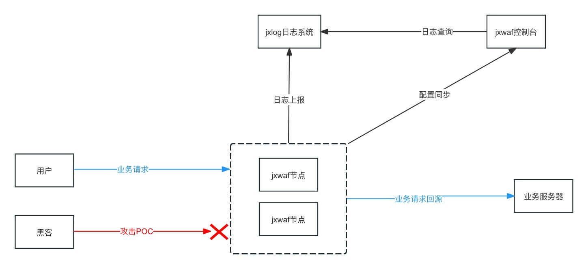
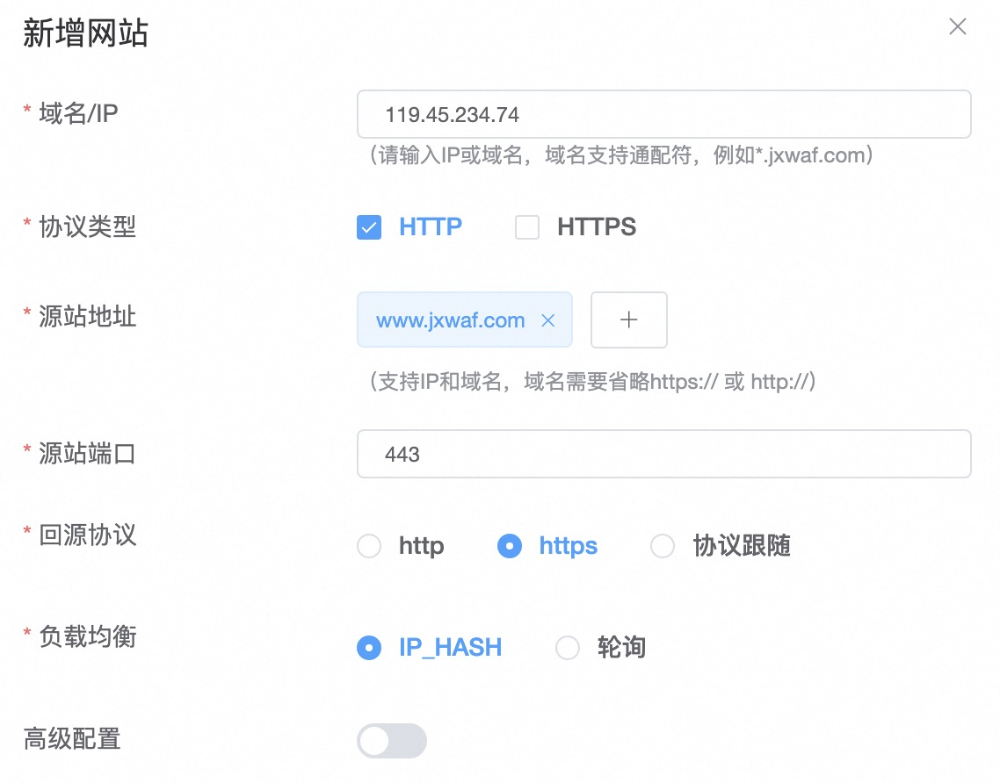
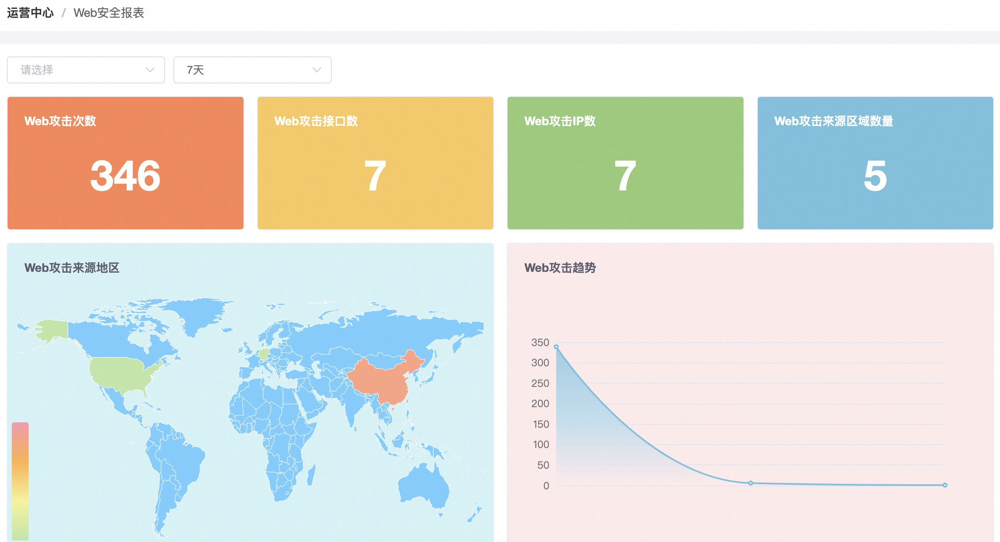
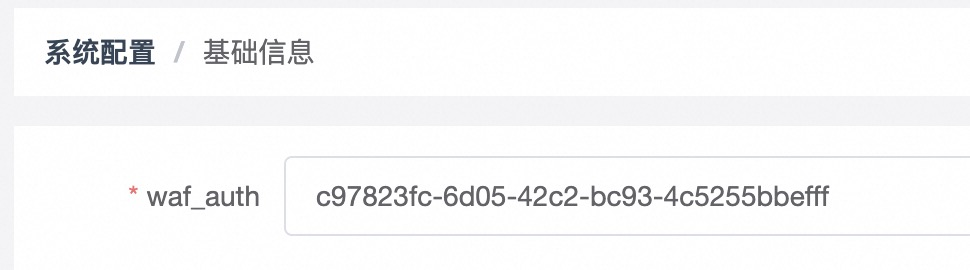
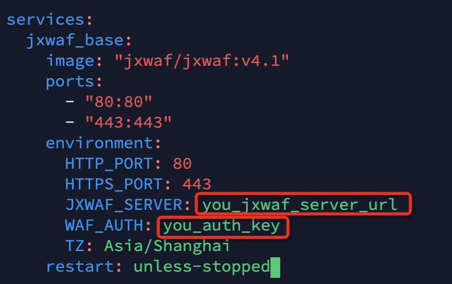
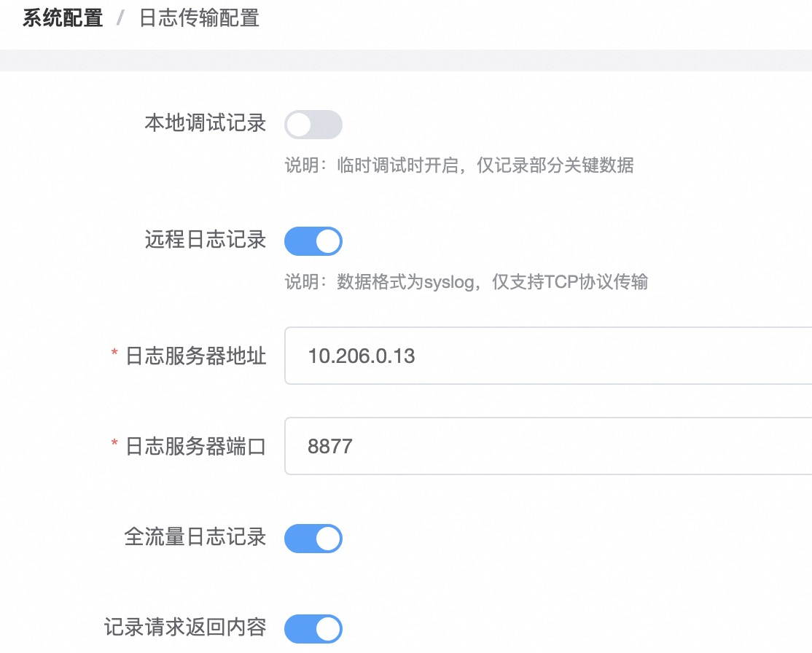
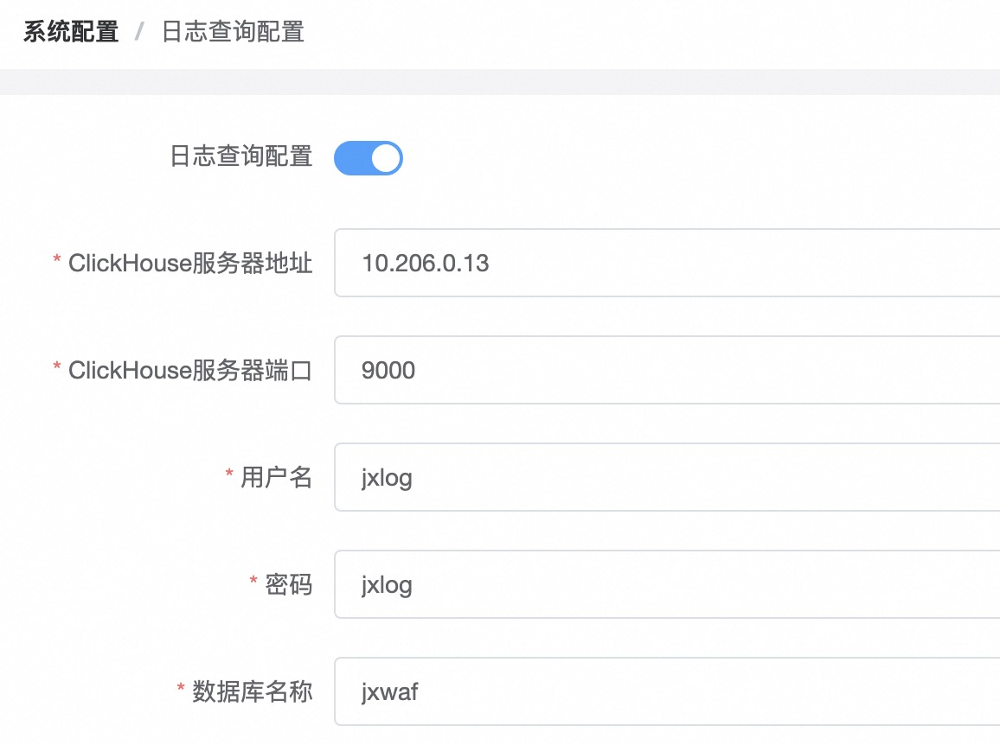
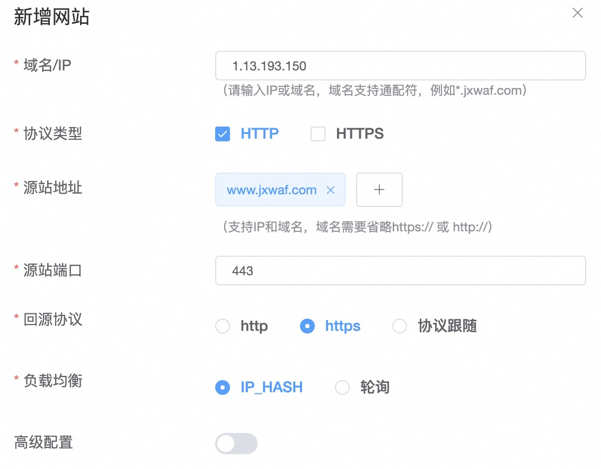
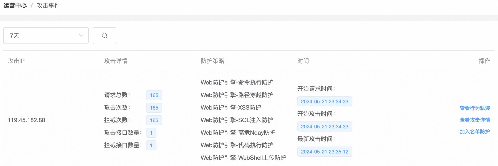

# JXWAF

[中文版](https://github.com/jx-sec/jxwaf/blob/master/README.md)
[English](https://github.com/jx-sec/jxwaf/blob/master/English.md)

### Introduced 介绍

JXWAF 是一款开源 WEB 应用防火墙

### Notice 通知

- JXWAF4 发布

### Feature 功能

- 防护管理
  - 网站防护
  - 名单防护
  - 基础组件
  - 分析组件
- 运营中心
  - 业务数据统计
  - Web安全报表
  - 流量安全报表
  - 攻击事件
  - 日志查询
  - 节点状态
- 系统管理
  - 基础信息
  - SSL证书管理
  - 日志传输配置
  - 日志查询配置
  - 拦截页面配置
  - 配置备份&加载

### Architecture 架构
- JXWAF系统由三个子系统组成
  - jxwaf控制台
  - jxwaf节点
  - jxlog日志系统 



### Demo Environment 线上演示环境

http://demo.jxwaf.com:8000/

帐号  test

密码  123456

### Test Environment Deployment 测试环境部署 

#### 环境要求

- 服务器系统 Centos 7.x

#### 快速部署

申请一台按量计费服务器，IP地址为 119.45.234.74 ，完成下面部署步骤

```
# 安装docker，国内网络建议输入 curl -fsSL https://get.docker.com | bash -s docker --mirror Aliyun
curl -sSLk https://get.docker.com/ | bash
service docker start
# 下载docker compose文件,国内网络建议输入 git clone https://gitclone.com/github.com/jx-sec/jxwaf-docker-file.git
yum install git -y
git clone https://github.com/jx-sec/jxwaf-docker-file.git
# 启动容器，国内网络建议输入 cd jxwaf-docker-file/test_env_cn
cd jxwaf-docker-file/test_env
docker compose  up -d
```

#### 效果验证

访问 控制台地址  http://119.45.234.74:8000  默认帐号为 test，密码为123456

登录控制台后，在网站防护中点击新建网站，参考如下配置进行设置



配置完成后，回到服务器 

```
[root@VM-0-11-centos test_env_cn]# pwd
/tmp/jxwaf-docker-file/test_env_cn
[root@VM-0-11-centos test_env_cn]# cd ../waf_test/
[root@VM-0-11-centos waf_test]# python waf_poc_test.py -u http://119.45.234.74
```

运行waf测试脚本后,即可在控制台中的运营中心查看防护效果



### Production Environment Deployment 生产环境部署

#### 环境要求

- 服务器系统 Centos 7.x

- 服务器推荐配置  4核8G以上

#### jxwaf控制台部署

服务器IP地址  
- 内网地址: 10.206.0.10


```
# 安装docker，国内网络建议输入 curl -fsSL https://get.docker.com | bash -s docker --mirror Aliyun
curl -sSLk https://get.docker.com/ | bash
service docker start
# 下载docker compose文件
yum install git -y
git clone https://github.com/jx-sec/jxwaf-docker-file.git
# 启动容器，国内网络建议输入 cd jxwaf-docker-file/prod_env_cn/jxwaf-mini-server
cd jxwaf-docker-file/prod_env/jxwaf-mini-server
docker compose  up -d
```

部署完成后，访问控制台地址http://10.206.0.10:8000，第一次访问控制台会自动跳转到帐号注册页面

完成注册并登录控制台后，点击 系统配置 -> 基础信息 页面，查看 waf_auth，后续节点配置需要



#### jxwaf节点部署

服务器IP地址  
- 公网地址: 1.13.193.150
- 内网地址: 10.206.0.3

```
# 安装docker，国内网络建议输入 curl -fsSL https://get.docker.com | bash -s docker --mirror Aliyun
curl -sSLk https://get.docker.com/ | bash
service docker start
# 下载docker compose文件
yum install git -y
git clone https://github.com/jx-sec/jxwaf-docker-file.git
# 启动容器，国内网络建议输入 cd jxwaf-docker-file/prod_env_cn/jxwaf
cd jxwaf-docker-file/prod_env/jxwaf
vim docker-compose.yml
```

修改文件中的 JXWAF_SERVER 和 WAF_AUTH 



JXWAF_SERVER的值为jxwaf控制台服务器地址，这里为 http://10.206.0.10:8000 ，注意这里地址不能带路径，即 http://10.206.0.10:8000/ 是错误输入

其中 WAF_AUTH为 系统配置 -> 基础信息 中 waf_auth的值


```
docker compose  up -d
```

启动后，可以在  运营中心 -> 节点状态  查看节点是否上线 


#### jxlog部署

服务器IP地址  
- 内网地址: 10.206.0.13

```
# 安装docker，国内网络建议输入 curl -fsSL https://get.docker.com | bash -s docker --mirror Aliyun
curl -sSLk https://get.docker.com/ | bash
service docker start
# 下载docker compose文件
yum install git -y
git clone https://github.com/jx-sec/jxwaf-docker-file.git
# 启动容器，国内网络建议输入 cd jxwaf-docker-file/prod_env_cn/jxlog
cd jxwaf-docker-file/prod_env/jxlog
docker compose  up -d
```

部署完成后，在控制台中  系统配置 -> 日志传输配置  完成如下配置



在 控制台 系统配置 -> 日志查询配置  完成如下配置，其中ClickHouse数据库的帐号密码可以在 docker-compose.yml 文件中修改 



#### 效果验证

在控制台 防护管理 -> 网站配置 ，点击新建网站，参考如下配置进行设置



配置完成后，jxlog服务器

```
[root@VM-0-13-centos jxlog]# pwd
/root/jxwaf-docker-file/prod_env_cn/jxlog
[root@VM-0-13-centos jxlog]# cd ../../waf_test/
[root@VM-0-13-centos waf_test]# python waf_poc_test.py -u http://1.13.193.150 
```

运行waf测试脚本后,即可在控制台中的 运营中心 -> 攻击事件 查看防护效果



### Contributor 贡献者

- [chenjc](https://github.com/jx-sec) 
- [jiongrizi](https://github.com/jiongrizi) 
- [thankfly](https://github.com/thankfly) 

### BUG&Requirement BUG&需求

- 微信 574604532  添加请备注 jxwaf  

- 微信群  不定期更新


