# JXWAF

[中文版](https://github.com/jx-sec/jxwaf/blob/master/README.md)
[English](https://github.com/jx-sec/jxwaf/blob/master/English.md)

## 介绍

JXWAF是一款云Web应用防火墙，可对Web应用流量进行分析检测，清洗过滤恶意流量后将正常流量返回给业务服务器，保障Web业务正常运行。

🌟  云WAF系统 | CDN加速 | 语义分析引擎 | WebTDS深度分析  

## 产品亮点

### 云WAF系统

JXWAF采用云原生架构设计，支持弹性扩展与多节点集群部署，可灵活适配公有云、混合云及私有化环境。通过分布式防护节点，实现流量智能调度与负载均衡，保障业务高可用性。

### CDN加速

深度融合CDN加速与安全防护能力，内置智能缓存引擎，支持动态内容缓存、边缘节点加速。通过缓存策略、不缓存策略的多级配置，显著降低源站负载压力，提升用户访问速度。结合IP区域封禁与流量防护规则，实现全球攻击流量清洗与合法请求加速的一体化处理，安全与性能双效提升。

### 语义分析引擎

自研语义分析引擎基于上下文语义的动态威胁识别技术，突破传统正则匹配局限，大幅提高了准确率，降低误报，可防御各类主流Web漏洞攻击，包括但不限于SQL注入、XSS攻击、命令执行攻击、代码执行攻击、高危Nday防护等。

### WebTDS深度分析

集成Web流量深度威胁感知系统（Web Threat Detection System），基于自研的数据实时分析引擎，通过实体行为分析和在线学习模型的检测能力，构建Web安全主动防御体系，实现APT级别攻击检测、高级CC攻击防护，业务安全风险分析。

## 文档

https://docs.jxwaf.com/

## 功能

- 防护管理
  - 网站防护
    - 防护配置 
      - Web防护引擎
      - Web防护规则
      - 扫描攻击防护
      - 网页防篡改
      - Web白名单规则
      - 流量防护引擎
      - 流量防护规则
      - IP区域封禁
      - IP黑名单
      - 流量白名单规则
    - 缓存配置
      - 缓存策略
      - 不缓存策略
      - 缓存绕过策略
    - 高级配置
      - 自定义请求头
      - 自定义响应头
      - 自定义响应内容
      - 自定义回源地址
  - 名单防护
  - 基础组件
  - 分析组件
- 运营中心
  - 数据统计
  - Web安全报表
  - 流量安全报表
  - 攻击事件
  - 日志查询
  - 网络封禁黑明单
  - 网络封禁白名单
  - 节点状态
- 系统管理
  - 基础信息
  - SSL证书管理
  - CNAME配置管理
  - 日志传输配置
  - 日志查询配置
  - WebTDS检测配置
  - 拦截页面配置
  - 配置备份&加载

## 架构

- JXWAF 系统由三个子系统组成
  - JXWAF 控制台
  - JXWAF 节点
  - JXLOG 日志系统

<kbd>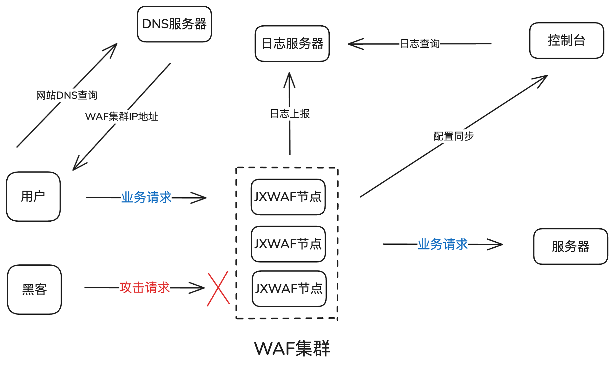</kbd>


## 部署

### 环境要求

- 服务器系统 Debian 12.x

- 服务器最低配置 4 核 8G 

### jxwaf 控制台部署

服务器 IP 地址

- 公网地址: 47.120.63.196
- 内网地址: 172.29.198.241

```
# 1. 安装Docker
curl -fsSL https://get.docker.com | bash -s docker --mirror Aliyun
# 2. 克隆仓库（国内可以换成 https://gitclone.com/github.com/jx-sec/jxwaf.git）
git clone https://github.com/jx-sec/jxwaf.git
# 3. 启动容器
cd jxwaf/jxwaf_admin_server
docker compose up -d
```

部署完成后，访问控制台地址 http://47.120.63.196， 第一次访问控制台会自动跳转到帐号注册页面。

完成注册并登录控制台后，点击 系统管理 -> 基础信息 页面，查看 waf_auth，后续节点配置需要 

<kbd>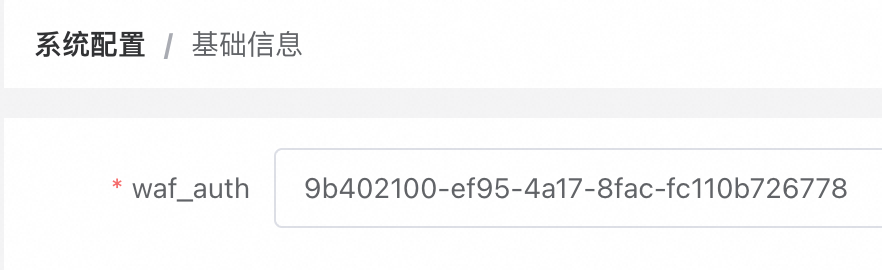</kbd>

### jxwaf 节点部署

服务器 IP 地址

- 公网地址: 47.84.176.156
- 内网地址: 172.22.168.117

```
# 1. 安装Docker
curl -fsSL https://get.docker.com | bash -s docker --mirror Aliyun
# 2. 克隆仓库（国内可以换成 https://gitclone.com/github.com/jx-sec/jxwaf.git）
git clone https://github.com/jx-sec/jxwaf.git
# 3. 启动容器
cd jxwaf/jxwaf_node
vim docker-compose.yml
```

修改文件中的 JXWAF_SERVER 和 WAF_AUTH

<kbd>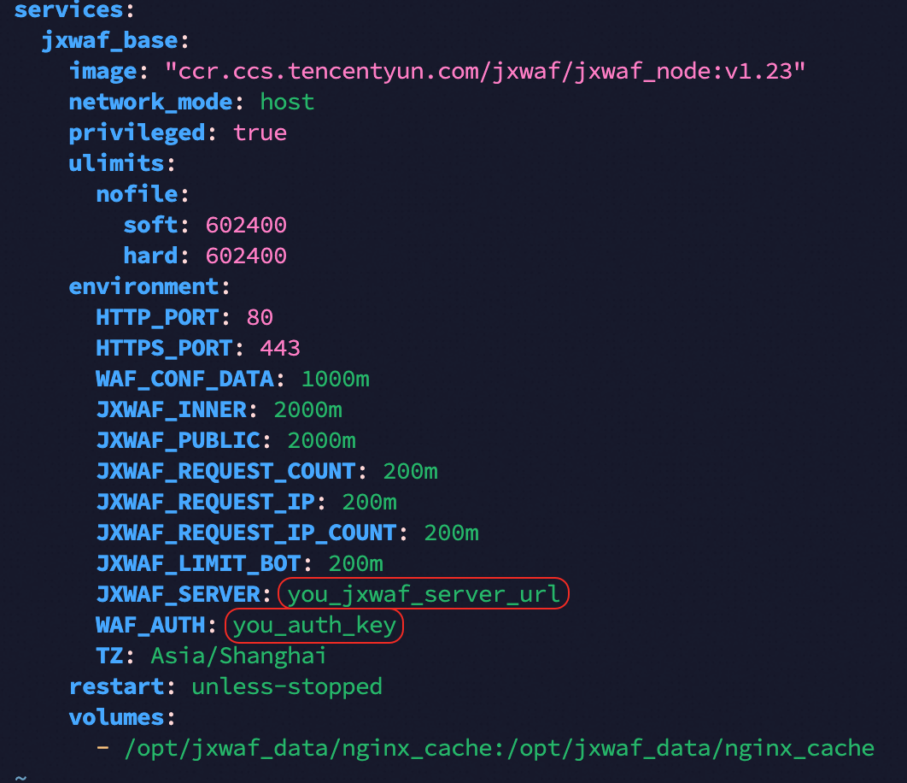</kbd>

JXWAF_SERVER 的值为 jxwaf 控制台服务器地址，这里为 http://47.120.63.196 ，注意地址不能带路径，即 http://47.120.63.196/ 是错误输入

其中 WAF_AUTH 为 系统管理 -> 基础信息 中 waf_auth 的值

修改后如下

<kbd>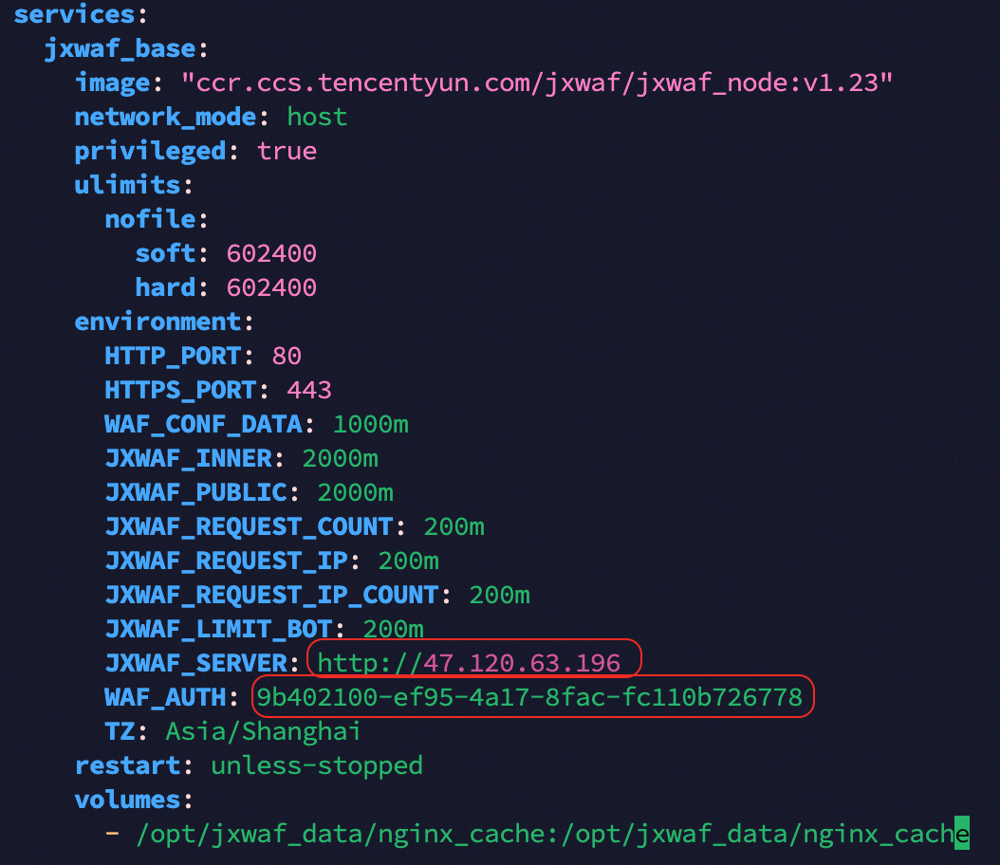</kbd>

```
docker compose  up -d
```

启动后，可以在 运营中心 -> 节点状态 查看节点是否上线

<kbd>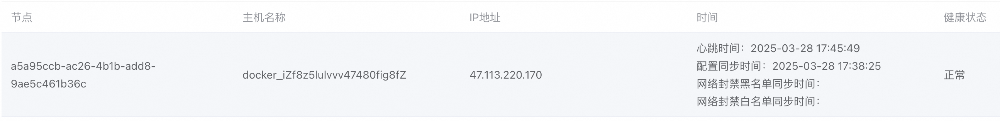</kbd>

### jxlog 部署

服务器 IP 地址

- 公网地址: 47.115.222.190
- 内网地址: 172.29.198.239

```
# 1. 安装Docker
curl -fsSL https://get.docker.com | bash -s docker --mirror Aliyun
# 2. 克隆仓库（国内可以换成 https://gitclone.com/github.com/jx-sec/jxwaf.git）
git clone https://github.com/jx-sec/jxwaf.git
# 3. 启动容器
cd jxwaf/jxlog
docker compose up -d
```

部署完成后，在控制台中 系统配置 -> 日志传输配置 完成如下配置

<kbd>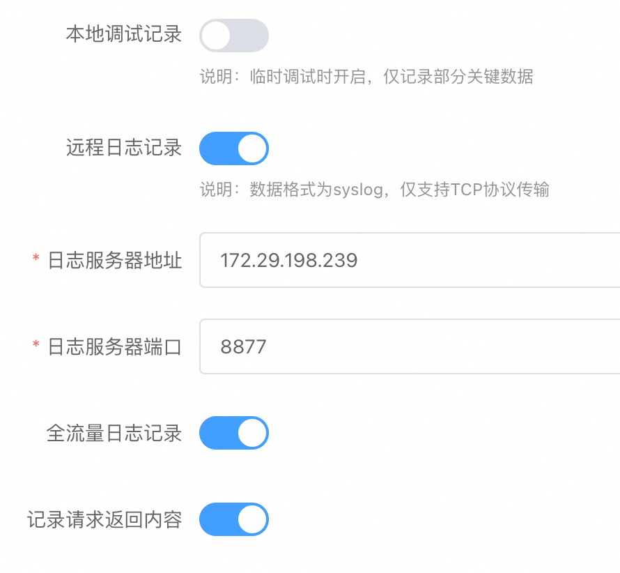</kbd>

在 控制台 系统配置 -> 日志查询配置 完成如下配置，其中 ClickHouse 数据库的帐号密码可以在 docker-compose.yml 文件中修改

<kbd>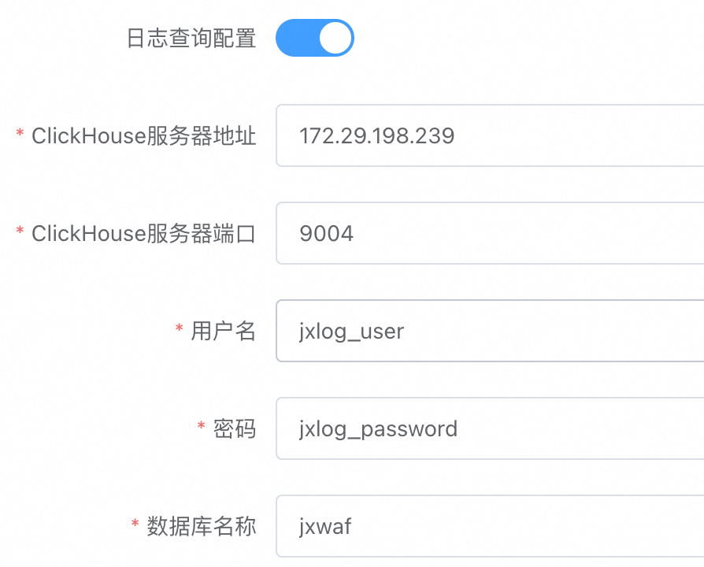</kbd>

### 效果验证

在控制台 防护管理 -> 网站防护 ，点击新建分组，参考如下配置进行设置

<kbd>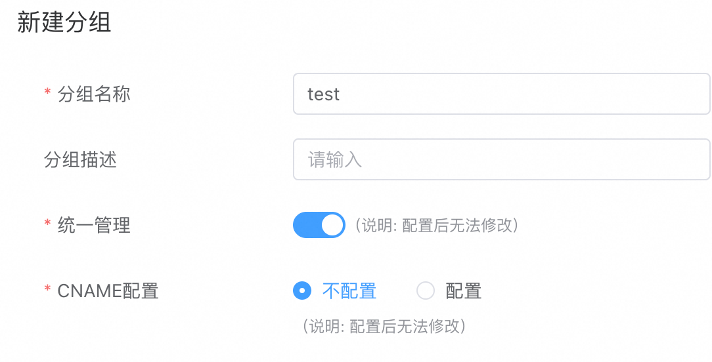</kbd>

创建完成后，点击 查看网站 ，点击新建网站，参考如下配置进行设置

<kbd>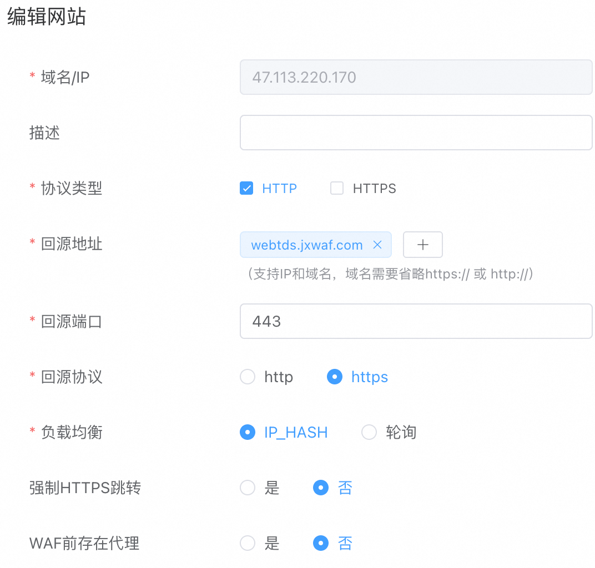</kbd>


配置完成后，回到 jxlog 服务器,

```
root@iZf8z5lulvvv47480fig8gZ:~/jxwaf# pwd
/root/jxwaf
[root@VM-0-13-centos jxlog]# cd waf_test/
[root@VM-0-13-centos waf_test]# python3 waf_poc_test.py -u http://47.113.220.170
```

运行 waf 测试脚本后,即可在控制台中的 运营中心 -> Web安全报表 和 运营中心 -> Web安全报表 查看防护效果

<kbd>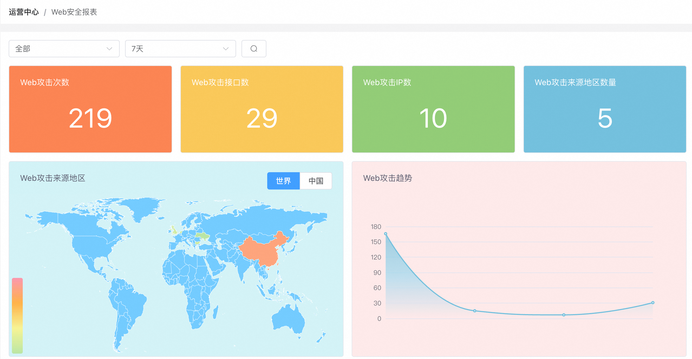</kbd>

<kbd>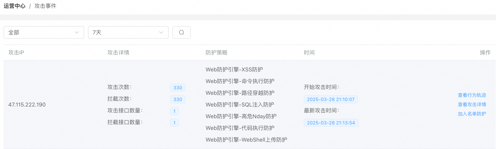</kbd>

## 性能测试

### 测试环境说明

服务器型号: 阿里云计算型c6

服务器配置: 4核8G

服务器操作系统: Debian 12.8 

控制台配置如下:

- 防护配置为开启流量防护引擎中的无差别紧急防护，执行动作设置为阻断请求

- 自定义拦截页面响应码设置为200，响应内容设置为空

- 日志记录关闭

测试环境为内网环境，仅测试WAF节点本身的性能极限，不涉及业务请求回源，数据仅供参考。

### wrk测试数据

#### HTTP请求性能测试

```
root@iZf8z5lulvvv47480fig8hZ:~# wrk -t8 -c5000 -d30s --timeout 10s http://172.29.198.240 
Running 30s test @ http://172.29.198.240
  8 threads and 5000 connections
  Thread Stats   Avg      Stdev     Max   +/- Stdev
    Latency   241.95ms  879.69ms  10.00s    95.25%
    Req/Sec     8.41k     3.17k   17.78k    69.67%
  1975398 requests in 30.05s, 491.69MB read
  Socket errors: connect 0, read 151, write 0, timeout 228
Requests/sec:  65726.31
Transfer/sec:     16.36MB
```

本次测试HTTP请求防护能力，单机QPS大概为65000左右。

#### HTTPS请求性能测试 

修改本地hosts，将admin.jxwaf.com解析为172.29.198.240

```
root@iZf8z5lulvvv47480fig8hZ:~# wrk -t8 -c5000 -d30s --timeout 10s https://admin.jxwaf.com
Running 30s test @ https://admin.jxwaf.com
  8 threads and 5000 connections
  Thread Stats   Avg      Stdev     Max   +/- Stdev
    Latency   223.82ms  590.66ms   5.94s    94.92%
    Req/Sec     5.49k     1.05k    9.80k    76.66%
  1058280 requests in 30.10s, 263.42MB read
  Socket errors: connect 249, read 0, write 0, timeout 0
Requests/sec:  35161.18
Transfer/sec:      8.75MB
```

本次测试HTTPS请求防护能力，单机QPS大概为35000左右。

## 贡献者

- [chenjc](https://github.com/jx-sec)
- [jiongrizi](https://github.com/jiongrizi)
- [thankfly](https://github.com/thankfly)

## BUG&需求

- 微信 574604532 添加请备注 jxwaf

