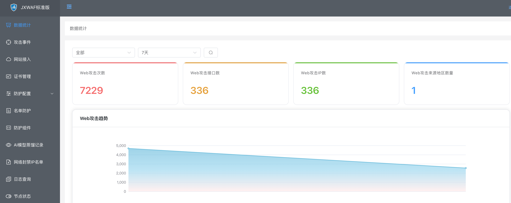
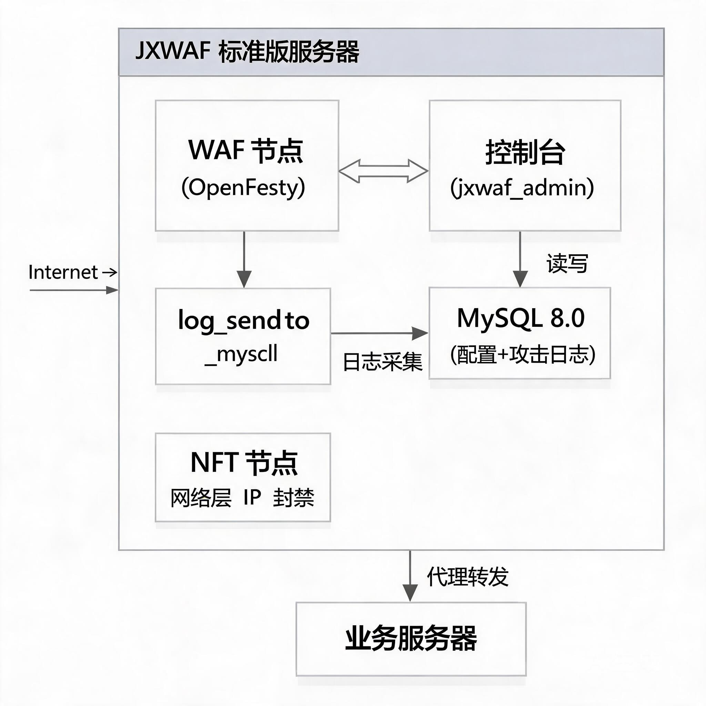
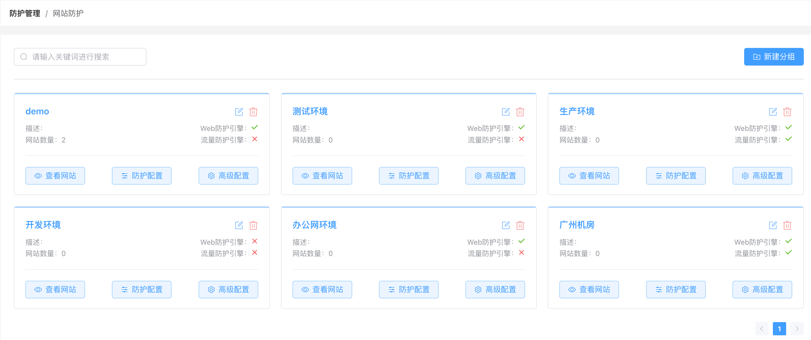
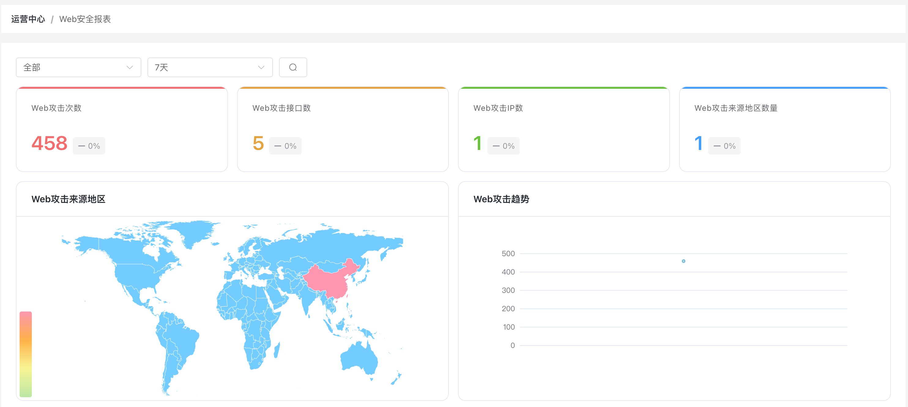
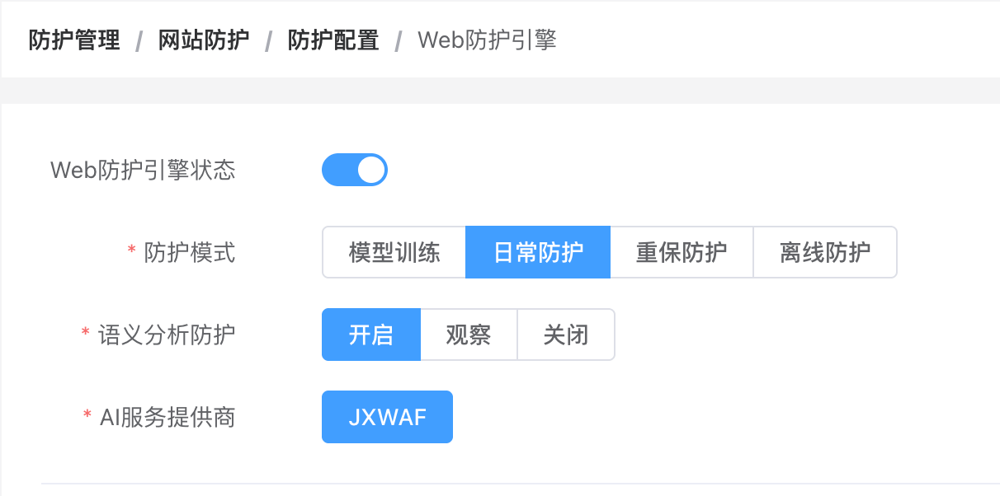
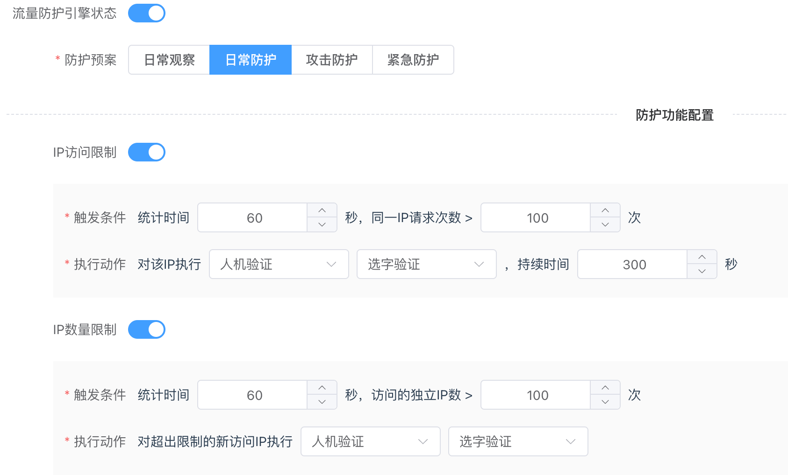
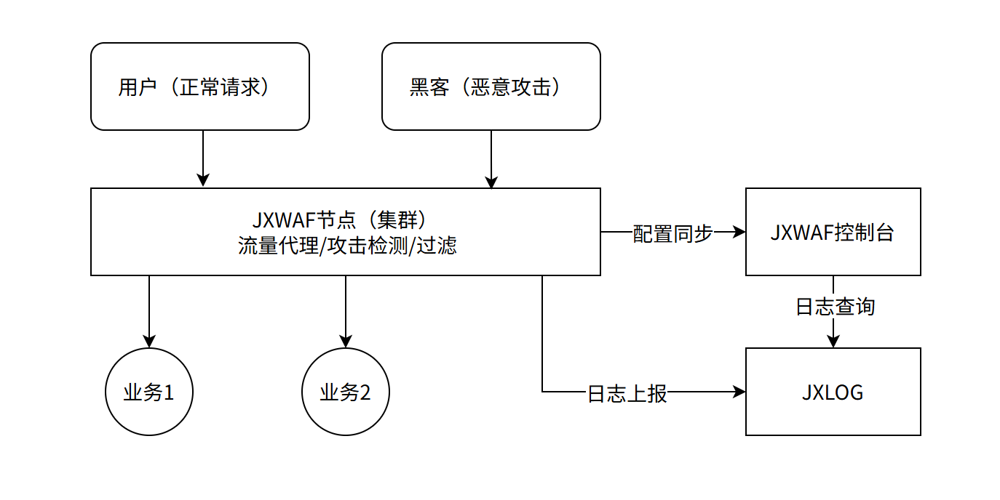

[English](English.md) | 中文

# JXWAF

基于 AI 大模型的 Web 应用防火墙，实时分析检测 Web 应用流量，清洗恶意流量后转发至业务服务器，保障业务安全稳定运行。

> 📖 **完整使用文档请访问** **[https://docs.jxwaf.com](https://docs.jxwaf.com)**

> 🔗 **专业版在线体验**：**[https://waf-demo.jxwaf.com](https://waf-demo.jxwaf.com)**  
> 账号：`demo`　密码：`123456`

> WAF默认使用官方提供的安全模型服务，大模型推理费用由平台承担，用户可免费使用。

> 标准版和专业版均无性能限制，用户只需根据业务需要选择合适的版本。

### 防护效果测试对比

以下是通过 BlazeHTTP 对多款 WAF 横向测试结果。其中 CloudFlare、ModSecurity、SafeLine 数据由 BlazeHTTP 公开发布，JXWAF 日常防护数据为最新版本BlazeHTTP实测结果：

| WAF | 检出率 ↑ | 误报率 ↓ | 准确率 ↑ |
|-----|----------|----------|----------|
| CloudFlare 免费版 | 10.70% | 0.07% | 98.40% |
| ModSecurity PARANOIA 1 | 69.74% | 17.58% | 82.20% |
| SafeLine 免费·平衡 | 71.65% | 0.07% | 99.45% |
| **JXWAF 日常防护（官方免费模型）** | **71.28%** | **0.64%** | **98.81%** |
| **JXWAF 日常防护（私有部署模型）** | **69.91%** | **0.20%** | **99.22%** |

## 版本选择

JXWAF 提供 **标准版** 和 **专业版** 两个版本，满足不同规模的业务需求：

| 维度 | 标准版 | 专业版 |
|------|--------|--------|
| 部署架构 | 单机部署 | 控制台、节点、日志分离部署 |
| 日志存储 | MySQL | ClickHouse（高性能分析） |
| 扩展方式 | 单节点 | 集群部署，可水平扩展 |
| WebTDS | 不支持 | 支持对接 |
| 适用场景 | 个人站点、小型企业 | 中大型企业 |

## 标准版

AI 安全模型 + 语义分析引擎双引擎驱动的 Web 应用防火墙，`docker compose up` 一条命令完成部署，免费使用。

与专业版的多服务器分离部署不同，标准版将 WAF 节点、控制台、数据库、日志采集、封禁模块整合于一台服务器，实时分析 Web 流量，过滤恶意请求后将正常流量转发至业务服务器。

<p align="center"></p>

### 三大核心技术

#### 1. AI 安全模型

JXWAF 自研多维稀疏注意力机制与在线蒸馏技术，将 AI 大模型的安全检测能力完整继承至本地推理引擎，实现 **高并发、低成本、低幻觉** 的 Web 安全检测。

- **0day 自动检测**：新型攻击出现后，AI 大模型第一时间完成分析，通过在线蒸馏将检测能力"教"给本地模型——无需人工编写规则，0day 攻击自动拦截。
- **误报自动处理**：模型更新期间出现误拦截，在线蒸馏完成后安全模型会自动加白，全程无需安全人员介入。
- **高性能、低成本**：纯 CPU 即可部署，一台 4 核 8G 服务器，全防护模块开启可支撑日均 8 亿次请求检测。默认使用官方提供的安全模型服务，大模型推理费用由平台承担，用户可免费使用。

#### 2. 语义分析引擎

采用上下文语义动态分析技术，突破传统正则匹配局限，大幅提升检测准确率、降低误报。可有效防御 SQL 注入、XSS、命令/代码执行、反序列化、高危 Nday 漏洞利用等各类主流 Web 攻击。

#### 3. SSL 行为分析引擎

基于全新 SSL 指纹算法，结合 SSL 协议交互异常行为分析，快速识别非浏览器访问，有效检测 **CC 攻击**、**爬虫访问** 等异常流量。

### 一键部署

标准版将 WAF 节点、控制台、MySQL、日志采集、网络封禁五个子系统打包成一个 `docker-compose.yml`，一条命令全部上线。

**环境要求**：Debian 12.x / Ubuntu 20.04+，4 核 8G 以上，需安装 Docker。

```bash
# 1. 安装 Docker（已安装可跳过）
curl -fsSL https://get.docker.com | bash -s docker --mirror Aliyun

# 2. 克隆仓库
git clone --depth=1 https://github.com/jx-sec/jxwaf.git
cd jxwaf/Standard/

# 3. 一键启动
docker compose up -d
```

部署完成后访问 `http://<服务器IP>:8000`，首次使用需注册账号。

四种防护模式灵活切换：**模型训练**（学习不处置）、**日常防护**（业务优先）、**重保防护**（安全优先）、**离线防护**（不联网可用）。

> 详细部署文档请参考 [标准版部署教程](https://docs.jxwaf.com/jxwaf-standard/Deployment-Tutorial.html)

### 系统架构

标准版将所有子系统部署在同一台服务器上：

<p align="center"></p>

| 子系统 | 说明 |
|------|------|
| `jxwaf_node_standard` | WAF 节点（OpenResty），流量入口，高性能代理与实时攻击检测 |
| `jxwaf_admin_server` | WAF 控制台，可视化运营界面与 API |
| `mysql_db` | MySQL 8.0，存储站点配置与攻击日志 |
| `log_send_to_mysql` | 日志采集，将节点攻击日志异步批量写入 MySQL |
| `jxwaf_nft_node` | 网络封禁模块，在网络层封禁攻击 IP |

> 攻击日志直接写入 MySQL，无需额外部署 ClickHouse，降低运维复杂度。

### 性能测试（单节点 4C8G）

使用 wrk 对真实业务接口测试（4 线程，1000 并发，60 秒）：

| 测试方案 | HTTP QPS | HTTPS QPS |
|----------|----------|-----------|
| 纯转发 | **67,849** | **55,227** |
| AI + 语义引擎 | **36,388** | **31,081** |
| 全部防护模块开启 | **10,574** | **7,739** |

全模块开启，单节点日均处理超 **8 亿次请求**。

> JXWAF 标准版不限制处理线程数、并发连接数、接入站点数及防护请求量，实测性能即用户实际可用性能。用户可通过提升服务器配置获得更好的性能表现。

详细压测数据见 [性能测试报告](https://docs.jxwaf.com/jxwaf-standard/Performance-Test.html)

### 防护能力测试

#### BlazeHTTP 横向对比

以下是通过 BlazeHTTP 对多款 WAF 横向测试结果。其中 CloudFlare、ModSecurity、SafeLine 数据由 BlazeHTTP 公开发布，JXWAF 日常防护数据为最新版本BlazeHTTP实测结果：

| WAF | 检出率 ↑ | 误报率 ↓ | 准确率 ↑ |
|-----|----------|----------|----------|
| CloudFlare 免费版 | 10.70% | 0.07% | 98.40% |
| ModSecurity PARANOIA 1 | 69.74% | 17.58% | 82.20% |
| SafeLine 免费·平衡 | 71.65% | 0.07% | 99.45% |
| **JXWAF 日常防护（官方免费模型）** | **71.28%** | **0.64%** | **98.81%** |
| **JXWAF 日常防护（私有部署模型）** | **69.91%** | **0.20%** | **99.22%** |

从测试数据可以看到：

- **检出率**：JXWAF 标准版（71.28%）与 SafeLine（71.65%）处于同一水平，ModSecurity 约为 69.74%，CloudFlare 免费版仅为 10.70%。
- **误报率**：JXWAF 标准版（0.64%）明显优于 ModSecurity（17.58%）。使用私有部署模型后，误报率进一步降至 0.20%，准确率达到 99.22%。

#### PayloadsAllTheThings 专项测试

基于 [PayloadsAllTheThings](https://github.com/swisskyrepo/PayloadsAllTheThings)（GitHub Star 78.1k）的 477 项测试，覆盖 36 种攻击分类，**综合通过率 96.6%**。SQL 注入、XSS、文件包含、反序列化、服务端注入等核心类别**全部 100% 通过**。

详细分类通过率见 [防护能力测试报告](https://docs.jxwaf.com/jxwaf-standard/Protection-Capability-Test.html)

## 专业版

**AI 安全模型** | **语义分析引擎** | **SSL 行为分析引擎** | **WebTDS 实时分析**

JXWAF 专业版由三个独立部署的子系统组成：

- **JXWAF 控制台（jxwaf_admin_server）** – Web 可视化运营界面，站点接入管理、策略配置、报表展示。
- **JXWAF 节点（jxwaf_node）** – 基于 OpenResty 的高性能流量代理与实时攻击检测引擎，支持集群与弹性伸缩。
- **JXLOG 日志系统（jxlog）** – 基于 Go 的轻量级日志采集，使用 ClickHouse 存储，支持事件分析与报表统计。

<table align="center">
  <tr>
    <td align="center"><b>网站防护</b></td>
    <td align="center"><b>Web安全报表</b></td>
  </tr>
  <tr>
    <td></td>
    <td></td>
  </tr>
  <tr>
    <td align="center"><b>Web防护引擎配置</b></td>
    <td align="center"><b>流量防护引擎配置</b></td>
  </tr>
  <tr>
    <td></td>
    <td></td>
  </tr>
</table>

### 产品亮点

#### AI 安全模型
基于自研多维稀疏注意力机制与在线蒸馏技术，将大模型检测能力高效继承至本地推理引擎，实现 **高并发、低成本、低幻觉** 的 Web 安全检测。支持 **0day 自动检测** 与 **误报自动处理**，显著降低运营成本。

#### 语义分析引擎
采用上下文语义动态分析技术，突破传统正则匹配局限，**精准识别攻击、大幅降低误报**。有效防御 SQL 注入、XSS、命令执行、代码执行及高危 NDay 漏洞利用等。

#### SSL 行为分析引擎
基于全新 SSL 指纹算法与协议异常行为分析，快速识别非浏览器访问，有效检测 **CC 攻击**、**爬虫访问** 等异常流量。

#### WebTDS 实时分析
对接 Web 流量威胁感知系统，自研实时大数据分析引擎实现毫秒级威胁分析（性能远超通用流处理系统）。无需编码，通过策略配置即可实现 **APT 检测**、**高级爬虫防护** 及 **业务安全风险分析**。

### 系统架构

<p align="center"></p>

JXWAF 专业版由三个独立部署的子系统组成：

- **JXWAF 控制台（jxwaf_admin_server）** – Web 可视化运营界面，站点接入管理、策略配置、报表展示。
- **JXWAF 节点（jxwaf_node）** – 基于 OpenResty 的高性能流量代理与实时攻击检测引擎，支持集群与弹性伸缩。
- **JXLOG 日志系统（jxlog）** – 基于 Go 的轻量级日志采集，使用 ClickHouse 存储，支持事件分析与报表统计。

### 快速部署

#### 环境要求

| 项目 | 要求 |
|------|------|
| 操作系统 | Debian 12.x |
| 最低配置 | 4 核 8G |
| 依赖 | Docker、Docker Compose |

> 安装命令：`curl -fsSL https://get.docker.com | bash -s docker --mirror Aliyun`

#### 1. JXWAF 控制台部署

```bash
git clone https://github.com/jx-sec/jxwaf.git
cd jxwaf/Professional/jxwaf_admin_server/

# 根据需求修改 docker-compose.yml（如 MySQL 密码、HTTPS 开关）
vim docker-compose.yml

docker compose up -d
```

部署后访问 `http://<公网IP>`，首次访问需注册账号（强烈建议开启 OTP 双因素认证）。  
登录后前往 **系统管理 → 基础信息** 获取 `waf_auth`，后续节点配置使用。

#### 2. JXWAF 节点部署

```bash
cd jxwaf/Professional/jxwaf_node

# 编辑 docker-compose.yml，修改：
#   JXWAF_SERVER = 控制台地址（如 http://47.120.63.196）
#   WAF_AUTH      = 控制台获取的 waf_auth
#   HTTP_PORT / HTTPS_PORT = 监听端口（支持逗号分隔）
vim docker-compose.yml

docker compose up -d
```

启动后在控制台 **运营中心 → 节点状态** 可查看节点是否上线。

#### 3. JXLOG 日志系统部署

```bash
cd jxwaf/Professional/jxlog
docker compose up -d
```

部署后，在控制台完成以下配置：

**系统配置 → 日志传输配置**（攻击日志上报到 jxlog）

| 配置项 | 值 |
|--------|-----|
| 日志服务器地址 | `<jxlog 内网 IP>` |
| 日志服务器端口 | `8877` |

**系统配置 → 日志查询配置**（通过 ClickHouse 查询日志）

| 配置项 | 值 |
|--------|-----|
| ClickHouse 地址 | `<jxlog 内网 IP>` |
| 端口 | `9004` |
| 用户名 / 密码 | `jxlog` / `jxlog`（生产环境务必修改） |
| 数据库 / 表名 | `jxwaf` / `jxlog` |

### 性能测试（单节点 4C8G）

| 测试方案 | HTTP QPS | HTTPS QPS | HTTP 损耗 | HTTPS 损耗 |
|----------|----------|-----------|-----------|------------|
| 纯转发（防护全关） | 48,262 | 30,422 | — | — |
| AI 防护 + 语义引擎 | 31,159 | 21,343 | ↓ 35.5% | ↓ 29.8% |
| 全部防护引擎开启 | 18,462 | 13,253 | ↓ 61.7% | ↓ 56.4% |

**结论**：
- 纯转发模式下单节点吞吐量超 **4.8 万 QPS**（HTTP）
- 开启 AI 与语义引擎后性能仅下降约 **30%**，极小代价换取深度防御
- 全防护模式下仍可支撑 **1.8 万+ QPS**，平均延迟 < 80ms，单核吞吐超 4600 QPS，日均处理超 15 亿请求
- 支持集群水平扩展，线性提升吞吐量，适配高并发企业场景

详细压测原始数据见 [性能测试报告](https://docs.jxwaf.com/jxwaf-professional/Performance-Test.html)

### 防护能力测试

测试基于 [PayloadsAllTheThings](https://github.com/swisskyrepo/PayloadsAllTheThings) 生成的 477 个攻击 POC，覆盖 36 种分类。

| 指标 | 数值 |
|------|------|
| 测试项目总数 | 477 |
| 成功拦截 | 461 |
| 未通过（漏报） | 16 |
| **综合通过率** | **96.6%** |

主要分类通过率：
- SQL 注入（含 MySQL/MSSQL/Oracle 等）：**100%**
- XSS（含上下文绕过）：**100%**
- 命令注入（含 WAF 绕过）：**95%+**
- 文件包含 / 目录遍历：**100%**
- 反序列化（Java/PHP/Python 等）：**100%**
- 服务端注入（SSTI/SSI/XSLT）：**100%**
- 文件上传（含绕过）：**100%**
- WAF 绕过专项（SQLi/XSS/命令/路径等）：**96%+**

详细分类通过率及未通过样本见 [防护能力测试报告](https://docs.jxwaf.com/jxwaf-professional/Protection-Capability-Test.html)

## 社区支持

### 微信公众号

关注微信公众号，获取最新更新与技术分享。

<p align="center"></p>

### 用户交流群

扫码加入微信用户群，与更多开发者交流讨论。

<p align="center"></p>

> 群二维码过期或满员时，请联系管理员微信：`574604532`（添加请备注 jxwaf）

## 贡献者

- [青冰](https://github.com/jx-sec)
- [jiongrizi](https://github.com/jiongrizi)

## 问题反馈

- 微信 `574604532`（添加好友请备注 jxwaf）